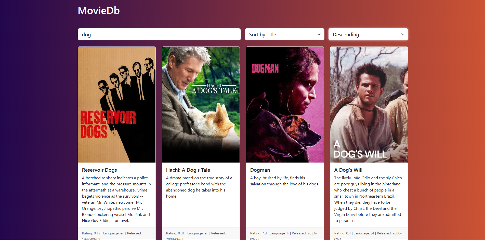

# MovieApp

A minimal ASP.NET Core C# web application that reads from a SQLite database (`movies.db`) and displays movie data in a Bootstrap-styled grid with live search, sorting, and ordering.

---

## 📂 Project Structure

```
MovieApp/
 ├── Models/
 │    ├── Movie.cs        # Defines the Movie POCO model
 │    └── MovieContext.cs # EF Core DbContext for SQLite
 ├── Views/
 │    └── index.html      # HTML template with placeholders
 ├── Program.cs           # Minimal API setup and endpoints
 ├── movies.db            # SQLite database (ignored by .gitignore)
 └── README.md            # This file
```

---

## 📸 Output Screenshot



---


## ⚙️ Run
   ```bash
   dotnet run
   ```
**Browse**
   Open your browser to `http://localhost:5000` (or port shown in console).

---

## 📄 Important Code Highlights

### Program.cs

- **DbContext Registration**  
  ```csharp
  builder.Services.AddDbContext<MovieContext>(options =>
      options.UseSqlite("Data Source=movies.db"));
  ```
  Registers the EF Core context to use `movies.db` as a SQLite datasource.

- **HTML Template Endpoint**  
  ```csharp
  app.MapGet("/", async (MovieContext db) => { ... });
  ```
  Reads `Views/index.html`, injects initial movie cards, and serves a full HTML page.

- **AJAX Data Endpoint**  
  ```csharp
  app.MapGet("/api/movies", async (MovieContext db, HttpContext http) => { ... });
  ```
  Handles live search (`search`), sorting (`sortBy`), and order (`asc`/`desc`).

- **Case-Insensitive Search**  
  ```csharp
  q = q.Where(m => EF.Functions.Like(m.Title, $"%{search}%"));
  ```
  Translates to SQL `LIKE '%search%'`, which is case-insensitive in SQLite.

- **Default Sort & Order**  
  ```csharp
  if (string.IsNullOrEmpty(sortBy)) sortBy = "title";
  if (string.IsNullOrEmpty(order))   order   = "asc";
  ```
  Ensures default behavior of sorting by title in ascending order.

- **Rounding Ratings**  
  ```csharp
  movies.ForEach(m => m.User_Rating = Math.Round(m.User_Rating, 2));
  ```
  Limits ratings display to two decimal places.

- **HTML Card Generation**  
  ```csharp
  static string GenerateMovieCards(List<Movie> movies) { ... }
  ```
  Converts `List<Movie>` into a concatenated string of Bootstrap card HTML.

### Views/index.html

- **Placeholders**
  ```html
  {{MOVIES}}       <!-- Injected movie cards -->
  {{SEARCH_TERM}}  <!-- Initial search box value -->
  ```
  Markers replaced server-side on initial load.

- **Live Search & Sort JS**
  ```html
  <script>
    async function refreshMovies() { ... }
    searchInput.addEventListener('input', refreshMovies);
    sortBySelect.addEventListener('change', refreshMovies);
    orderBySelect.addEventListener('change', refreshMovies);
    window.addEventListener('DOMContentLoaded', refreshMovies);
  </script>
  ```
  Fetches `/api/movies?search=...&sortBy=...&order=...` and swaps `#movieGrid` HTML in place.

---

